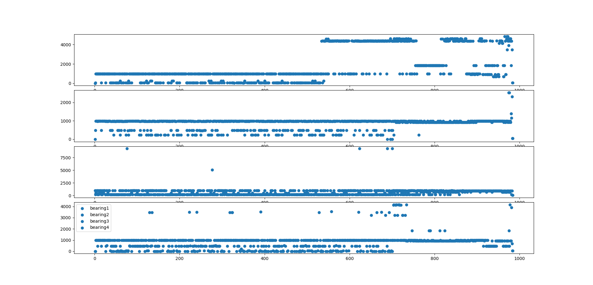
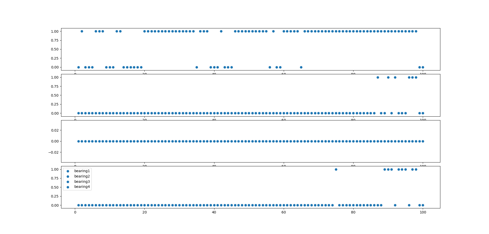
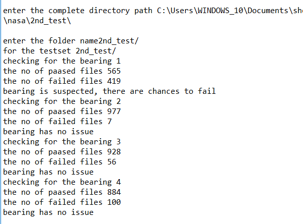

# Real-time time-series anomaly detection

| Programming Language |  Python |
| --- | --- |
| Skills (beg, intermediate, advanced) |  Intermediate |
| Time to complete project (in increments of 15 min) |  25 min |
| Hardware needed (hardware used) | Up Squared* board  |
| Target Operating System |   |

The monitoring of manufacturing equipment is vital to any industrial process. Sometimes it is critical that equipment be monitored in real-time for faults and anomalies to prevent damage and correlate equipment behavior faults to production line issues. Fault detection is the pre-cursor to predictive maintenance.

There are several methods which don&#39;t require training of a neural network to be able to detect failures, starting with the most basic (FFT), to the most complex (Gaussian Mixture Model). These have the advantage of being able to be re-used with minor modifications on different data streams, and don&#39;t require a lot of known previously classified data (unlike neural nets). In fact, some of these methods can be used to classify data in order to train DNNs.

## What you&#39;ll learn

- Basic implementation of FFT, Logistic Regression.
- How FFT is helpful in Feature engineering of vibrational data of a machine.

## Setup

- Download the Bearing Data Set (also on [https://ti.arc.nasa.gov/tech/dash/groups/pcoe/prognostic-data-repository/](https://ti.arc.nasa.gov/tech/dash/groups/pcoe/prognostic-data-repository/))
- Extract the zip format of data into respective folder named 1st\_test/2nd\_test.
- Make sure you have the following libraries:

     * Numpy
     * Pandas
     * Matplotlib.pyplot
     * Sklearn
     * Scipy

- Download the code
- Make sure all the code and data in one folder

## Gather your materials

- [UP Squared* board](http://www.up-board.org/upsquared/)

## Get the code

Open the example in a console or any python supported IDE( Spyder ). Set the working directory where your code and dataset is stored.

## Run the application
For logistic Regression there are 3 files to execute.

| SAMPLE FILE NAME | EXPECTED OUTPUT | Note |
| --- | --- | --- |
| Utils.py | Have all the function for all the module |   |
| Train\_logistic\_regression.py | Saved weight of the trained module in the filename &quot;LogisticRegression&quot; | Training for the logistic Regression is done on testset1 ,bearing4\_y axis (failed ),bearing 2\_x axis (passed ) and testset2 bearing1(failed),bearing2(passed)\*training dataset is increased for better result. |
| Test\_logistic\_regression.py | Result for the particular test set which bearing is failed and the plot of last 100 predicted labels for all the bearings. | Take the input path from the user to check which bearing is suspected to fail and which is in normal condition.

## How it works:

1. **FFT**: A fast Fourier transform (FFT) is an algorithm that samples a signal over a period of time (or space) and divides it into its frequency components. These components are single sinusoidal oscillations at distinct frequencies each with their own amplitude and phase.

     [Y](https://in.mathworks.com/help/matlab/ref/fft.html#f83-998360-Y) = fft([X](https://in.mathworks.com/help/matlab/ref/fft.html#f83-998360-X)) computes the discrete Fourier transform (DFT) of X using a fast Fourier transform (FFT) algorithm. If X is a vector, then fft(X) returns the Fourier transform of the vector [**More Details**](https://en.wikipedia.org/wiki/Fast_Fourier_transform)

2. **Logistic Regression**: Logistic regression is a statistical method for analyzing a dataset in which there are one or more independent variables that determine an outcome. The outcome is measured with a dichotomous variable (in which there are only two possible outcomes).

     In logistic regression, the dependent variable is binary or dichotomous, i.e. it only contains data coded as 1 (TRUE, success, pregnant, etc.) or 0 (FALSE, failure, non-pregnant, etc.).The goal of logistic regression is to find the best fitting (yet biologically reasonable) model to describe the relationship between the dichotomous characteristic of interest (dependent variable = response or outcome variable) and a set of independent (predictor or explanatory) variables. [**More Details**](https://en.wikipedia.org/wiki/Logistic_regression)

## Code Explanation

For all the samples the basic approach is same. Following are the steps that are basic steps:

- Take the fft of each bearing of each file.
- Calculate the Frequency and amplitude of it
- Calculate the top 5 amplitude and their corresponding frequency.
- Repeat the same for each bearing and each data file. Stored the result in the result data frame.

### For FFT: it gives the Frequency vs time plot of each maximum frequency for each dataset.

*Figure 1.plot for the testset2, max2 frequency for all the bearing.*

### For Logistic regression

Calculate the label for the data frame (in depended variable). Assume that first 70% is in normal condition and rest 71-100% are suspected to fail. For the passed one give label &#39;0&#39; and for suspected to fail give label &#39;1&#39;. Train the logistic regression on result data frame. Stored the model using numpy.

For testing: Take input path from the user, he wants to check which bearing is suspected to fail which is in normal condition. Check the no of one label, and no of zero label in the last 100 predictions. If the no of one prediction is more than no oh zero label, then bearing is suspected to fail else it is in normal condition.

 
 *Figure 2.predicted last 100  labels for testset2, for all four bearings*

 
 *Figure 3.result for the bearing which is failed for the testset2*

**NOTE:**

TESTSET 3 of NASA the bearing dataset is discarded for the observations because of the following reasons:

1: It has 6324 file in actuality, but according to the documentation its contains 4448 data file. This makes very noisy data.

2: None of the bearing indicate symptoms of failure. However, it suddenly fails. This makes data inconsistent.

The above listed reasons describe how testset3 exhibits unpredictable behavior.
